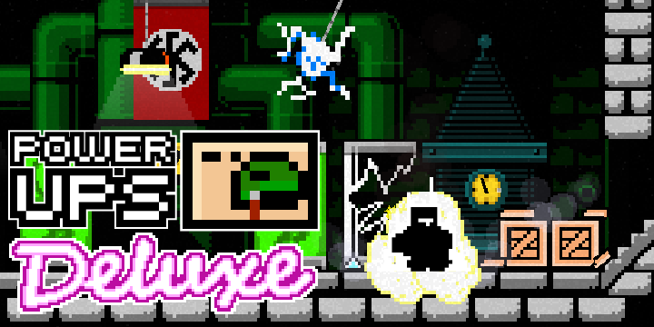

# 💉 Power-ups Deluxe

The collaborative [Superfighters Deluxe](http://superfightersdeluxe.com) script Power-ups Deluxe.

This script enhances your gameplay experience by adding a variety of power-ups created by different scripters. These power-ups can be obtained through special crates and activated with a syringe.

> [!IMPORTANT]  
> The collaboration is ongoing! We're inviting you to contribute your own unique power-up ideas and scripts. Learn more in the [map editor discord](https://discord.gg/jvvZgrb).

Steam🔜 | [MythoLogic Forum Post](https://mythologicinteractiveforums.com/viewtopic.php?f=42&t=4414)

## ⚙️ Commands

|Command|Description|
|-|-|
|`PD_HELP`|Shows command help.|
|`PD_POWERUPS`|Displays all the power-ups with their codenames.|
|`PD_CRATE_CHANCE [chance]`|Sets or gets the spawn chance of a power-up crate.|
|`PD_SYRINGE [player]`|Gives a player a power-up syringe.|
|`PD_POWERUP <powerup> [player]`|Gives a player a power-up.|

Required options are shown with <>, optional parameters are shown with [].

## 📦 Power-ups

Power-ups appear inside a special crate, which drops a syringe when opened. This syringe can be used to acquire a random power-up.

Below is a list of the available power-ups.

### [Adrenaline](Submissions/Adrenaline.cs)

- **Author:** dsafxP
- **Duration:** 18 seconds
- **Description:** The player gains the ability to move while attacking, jump at any time, allowing for interesting maneuvers such as the roll jump, and there is no cooldown while jump attacking.

### [Air dash](Submissions/AirDash.cs)

- **Author:** [Danila015](https://steamcommunity.com/profiles/76561198847470828)
- **Duration:** 27 seconds
- **Description:** The player will dash forward when uppercutting, enabling extremely quick travel.

### [Arsenal](Submissions/Arsenal.cs)

- **Author:** dsafxP
- **Duration:** 7 seconds
- **Description:** The player will continuously receive weapons to fill their empty slots, along with an ammo stash.

### [Berserk](Submissions/Berserk.cs)

- **Author:** [Danila015](https://steamcommunity.com/profiles/76561198847470828)
- **Duration:** 35 seconds
- **Description:** The player's health will be reduced to 1, but they will gain immortality, a strength and speed boost, and the ability to perform super jumps while holding the jump key.

### [Blitzkrieg](Submissions/Blitzkrieg.cs)

- **Author:** dsafxP
- **Duration:** 19 seconds
- **Description:** The player starts hurling molotovs and explosives at the nearest enemy, gaining explosive and impact resistance, enabling them to rush enemies and blow them up.

### [Clone-o-matic](Submissions/Clone.cs)

- **Author:** [Ebomb09](https://steamcommunity.com/id/ebomb09)
- **Duration:** 24 seconds
- **Description:** Spawns a clone of the player that assists them but slowly ages and eventually dies as a result.

### [Drone](Submissions/Drone.cs)

- **Author:** dsafxP
- **Duration:** 25 seconds
- **Description:** The player gains control of a versatile drone that deals damage to nearby enemies.

### [Fire breath](Submissions/FireBreath.cs)

- **Author:** [Danila015](https://steamcommunity.com/profiles/76561198847470828)
- **Duration:** 25 seconds
- **Description:** The player automatically breathes fire at nearby enemies, but this action decreases the remaining time of the power-up.

### [Flame](Submissions/Flame.cs)

- **Author:** dsafxP
- **Duration:** 20 seconds
- **Description:** The player ignites without taking damage, gaining a slight movement boost and the ability to spread fire everywhere.

### [Giant](Submissions/Giant.cs)

- **Author:** [Tomo](https://steamcommunity.com/profiles/76561198337852780)
- **Duration:** 17 seconds
- **Description:** The player becomes massive, gaining complete immunity to stuns and reduced damage. Their melee strength is increased, allowing them to quickly destroy objects. Although they move slower, they can shake nearby objects and players, stunning and throwing them with powerful ground slams.

### [Grabby hands](Submissions/GrabbyHands.cs)

- **Author:** dsafxP & [Danila015](https://steamcommunity.com/profiles/76561198847470828)
- **Duration:** 14 seconds
- **Description:** The player automatically steals the drawn weapon from enemies.

### [Kamikaze](Submissions/Kamikaze.cs)

- **Author:** [Danila015](https://steamcommunity.com/profiles/76561198847470828)
- **Duration:** 7 seconds
- **Description:** Initiates a timer that, upon expiration, triggers numerous explosions around the player, inflicting minimal harm to the player.

### [Magnetic field](Submissions/Magnet.cs)

- **Author:** [Tomo](https://steamcommunity.com/profiles/76561198337852780)
- **Duration:** 31 seconds
- **Description:** Pushes away thrown objects, explosives, and other hazards while attracting weapons and supply crates.

### [Mana shield](Submissions/ManaShield.cs)

- **Author:** [Danger Ross](https://steamcommunity.com/profiles/76561198086215978)
- **Duration:** 25 seconds
- **Description:** Blocks a single hit of any kind and deflects projectiles, but will break against anything larger than a bullet.

### [Overcharge](Submissions/Overcharge.cs)

- **Author:** dsafxP, [Danila015](https://steamcommunity.com/profiles/76561198847470828) & [Eiga](https://steamcommunity.com/profiles/76561198351198371)
- **Duration:** 33 seconds
- **Description:** The player can perform consecutive kicks and uppercuts to increase their force, but failing to maintain the combo will cause them to lose the bonus.

### [Overheal](Submissions/Overheal.cs)

- **Author:** [Danila015](https://steamcommunity.com/profiles/76561198847470828)
- **Duration:** 40 seconds
- **Description:** Initiates health regeneration for the player until fully healed, which then slightly improves the player's maximum health permanently. This effect stops upon any damage inflicted by another player.

### [Punchback](Submissions/Punchback.cs)

- **Author:** dsafxP
- **Duration:** 25 seconds
- **Description:** The player can absorb bullets without taking damage and can shoot them back by punching.

### [Rocket shoes](Submissions/RocketShoes.cs)

- **Author:** [Ebomb09](https://steamcommunity.com/id/ebomb09)
- **Duration:** 20 seconds
- **Description:** The player can hover slightly in the air.

### [Sphere](Submissions/Sphere.cs)

- **Author:** dsafxP
- **Duration:** 24 seconds
- **Description:** A sphere surrounds the player, reflecting every critical-hit bullet back at the enemy.

### [Starred](Submissions/Star.cs)

- **Author:** [Tomo](https://steamcommunity.com/profiles/76561198337852780)
- **Duration:** 9 seconds
- **Description:** The player begins to flash with every color, becoming invincible. Upon contacting an enemy, they are damaged and pushed away.

### [Stone skin](Submissions/StoneSkin.cs)

- **Author:** [Danila015](https://steamcommunity.com/profiles/76561198847470828)
- **Duration:** 13 seconds
- **Description:** The player's skin turns to stone, granting immunity to stun and reducing damage taken from all sources. However, they become slower, unable to run, and heavier, allowing them to fall onto enemies to deal heavy damage.

### [Super dove](Submissions/SuperDove.cs)

- **Author:** [Luminous](https://steamcommunity.com/id/fakeluminous)
- **Duration:** 15 seconds
- **Description:** The player transforms into a dove, gaining the ability to fly and shoot eggs that deal heavy damage to enemies.

### [Telekinesis](Submissions/Telekinesis.cs)

- **Author:** dsafxP
- **Duration:** 27 seconds
- **Description:** The player can grab and throw nearby objects using the activate key. They can also control the direction of their thrown objects and bullets with their movement.

### [Thorns](Submissions/Thorns.cs)

- **Author:** dsafxP & [Motto73](https://steamcommunity.com/profiles/76561198279459977)
- **Duration:** 17 seconds
- **Description:** Enemies will receive heavy damage when they hit the player.

### [Tri-strike](Submissions/Strike.cs)

- **Author** dsafxP & [Eiga](https://steamcommunity.com/profiles/76561198351198371)
- **Duration:** 17 seconds
- **Description:** The player's melee attacks become unblockable and stun the enemy with every hit, while also dealing slightly more damage and force.

### [Blood turret](Submissions/Turret.cs)

- **Author:** dsafxP
- **Duration:** 17 seconds
- **Description:** A blood orb will follow the player, shooting blood projectiles at enemies.

### [Vampirism](Submissions/Vampirism.cs)

- **Author:** [Danila015](https://steamcommunity.com/profiles/76561198847470828)
- **Duration:** 21 seconds
- **Description:** The player gains the ability to drain life from opponents, causing them to bleed.

### [Vortex](Submissions/Vortex.cs)

- **Author:** dsafxP
- **Duration:** 17 seconds
- **Description:** A vortex will follow the player, drawing in useful objects and enemies, making them vulnerable to melee attacks.
